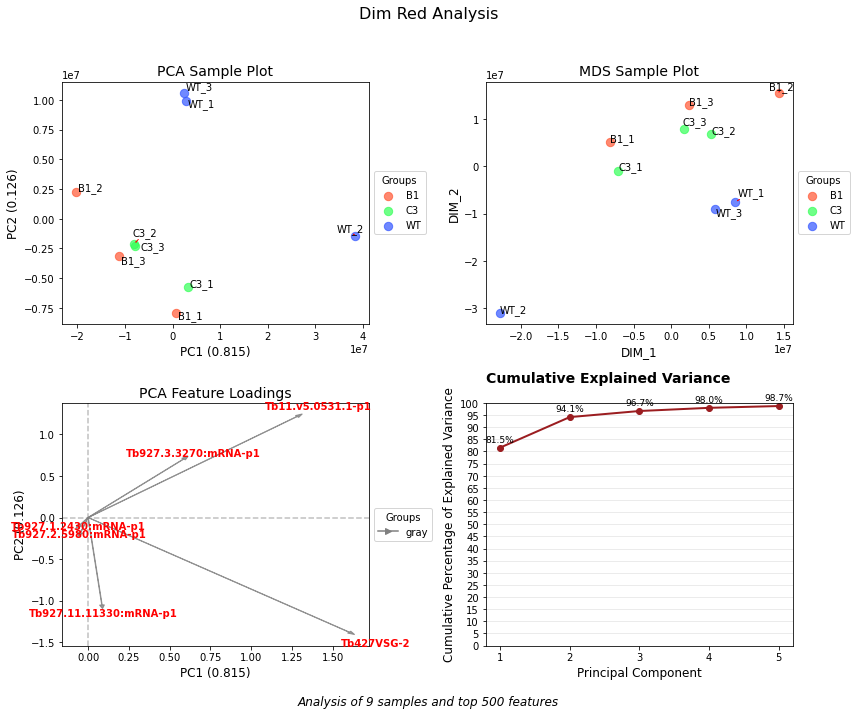
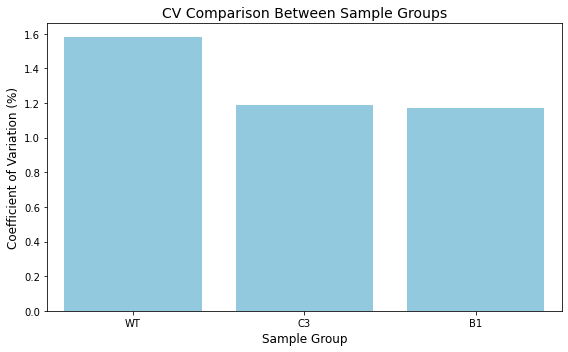

# Project Utility


<!-- WARNING: THIS FILE WAS AUTOGENERATED! DO NOT EDIT! -->

> This project is a collection of essential functions and utilities that
> I frequently use in my data analysis workflows.

## Why This Project Exists

As a data analyst, I found myself repeatedly writing the same helper
functions across different projects. ProjectUtility centralizes these
common utilities into a single, well-documented package that can be
easily imported into any analysis.

### Install ProjectUtility in Development mode

If you are new to using `nbdev` here are some useful pointers to get you
started.

``` sh
# make sure ProjectUtility package is installed in development mode
$ pip install -e .

# make changes under nbs/ directory
# ...

# compile to have changes apply to ProjectUtility
$ nbdev_prepare
```

## Usage

Install latest from the GitHub
[repository](https://github.com/mtinti/ProjectUtility):

``` sh
$ pip install git+https://github.com/mtinti/ProjectUtility.git
```

or from [conda](https://anaconda.org/mtinti/ProjectUtility)

``` sh
$ conda install -c mtinti ProjectUtility
```

or from [pypi](https://pypi.org/project/ProjectUtility/)

``` sh
$ pip install ProjectUtility
```

# Data Science Q&A

## 🔍 Question

> Can you visualize the pattern of missing values in my dataset?

``` python
from ProjectUtility import mis_val_utility
import pandas as pd
df = pd.read_csv('../tests/missing_values/test_df.csv.gz',index_col=[0])
mv_analyzer = mis_val_utility.MissingValuesAnalyzer(df)
fig, axes, summary = mv_analyzer.plot_missing_dashboard(figsize=(10, 12))
```

    /Users/MTinti/miniconda3/envs/work3/lib/python3.10/site-packages/pandas/core/arrays/masked.py:60: UserWarning: Pandas requires version '1.3.6' or newer of 'bottleneck' (version '1.3.4' currently installed).
      from pandas.core import (


## 🔍 Question

> Can you reduce the dimensionality of my dataset to visualize patterns
> and relationships?

``` python
from ProjectUtility import dim_red_utility
import matplotlib.pyplot as plt
from ProjectUtility.core import convert_palette_to_hex, create_group_color_mapping


sample_groups, color_dictionary = create_group_color_mapping(df.columns, 
                                                             group_size=3, 
                                                             return_color_to_group=True)

color_dictionary = {'#FF5733': 'B1', '#33FF57': 'C3', '#3357FF': 'WT'}

fig, axes, results_dict = dim_red_utility.create_dim_reduction_dashboard(
    in_df=df.dropna(),
    sample_palette=sample_groups,
    feature_palette={},
    top=500,
    color_dictionary=color_dictionary,
    title="Dim Red Analysis",
    figsize=(12, 10)  
)
plt.tight_layout(rect=[0, 0.03, 1, 0.95])
```

    Explained variance ratio: [0.81546122 0.12599201 0.02508285 0.01313488 0.00740248]



## 🔍 Question

> Can you assess the reproducibility of my dataset?

``` python
from ProjectUtility import correlation_utilities
import numpy as np
cv_sample_groups = [
    'B1', 'B1', 'B1', 
    'C3', 'C3', 'C3',
    'WT', 'WT', 'WT']
analyzer = correlation_utilities.ReplicateAnalyzer(
    np.log10(df.dropna()), cv_sample_groups)
# Calculate coefficient of variation
cv_results = analyzer.calculate_coefficient_of_variation()
print("Coefficient of Variation Results:")
print(cv_results)

# Visualize the results
fig = analyzer.plot_coefficient_of_variation(
    title="CV Comparison Between Sample Groups",
    figsize=(8, 5)
)
```

    Coefficient of Variation Results:
    {'WT': 1.5810533161044804, 'B1': 1.17165193540931, 'C3': 1.191373053916986}



> Can you do the same row wise?

``` python
cv_distribution = analyzer.calculate_cv_distribution(exclude_zeros=True)
# Create the CV boxplot
print("\nGenerating CV distribution boxplot...")
fig2 = analyzer.plot_cv_boxplot(
    min_y=0,  # Minimum y-axis value
    max_y=5,  # Maximum y-axis value
    figsize=(6, 6),
    color_palette="viridis",
    display_median=True,
    reference_line=3,  
    title="Distribution of Coefficient of Variation Across Sample Groups"
)

# Show plots
plt.tight_layout()
plt.show()
```


    Generating CV distribution boxplot...


## 🔍 Question

> Can you show me an interactive volcan plot?

``` python
from ProjectUtility import diff_expr
column_mapping = {
    'log2fc': 'logFC',            # logFC column from your data
    'fdr': 'FDR',                # FDR column from your data
    'avg_intensity': 'log_AveExpr', # log_AveExpr column from your data
    'id': 'Gene_id',            # Gene_acc column from your data
    'description': 'Desc'         # Desc column from your data
}

file_path = '../tests/volcano_plots/for_web_limma_WT-C3.csv.zip'
# Create the PlotData instance
plot_data = diff_expr.PlotData(file_path, column_mapping, highlight_ids=['Blasticidin','Puromycin'])
# Quick access to all plotting data
_ = plot_data.get_data_for_plotting()
```

``` python
fig = diff_expr.create_volcano_ma_plots(
    plot_data,
    plot_title="Differential Expression Analysis: Sample vs Control"
)
fig.show('iframe')
```

<iframe
    scrolling="no"
    width="620px"
    height="820"
    src="iframe_figures/figure_6.html"
    frameborder="0"
    allowfullscreen
></iframe>

## Documentation

Documentation can be found hosted on this GitHub
[repository](https://github.com/mtinti/ProjectUtility)’s
[pages](https://mtinti.github.io/ProjectUtility/). Additionally you can
find package manager specific guidelines on
[conda](https://anaconda.org/mtinti/ProjectUtility) and
[pypi](https://pypi.org/project/ProjectUtility/) respectively.
