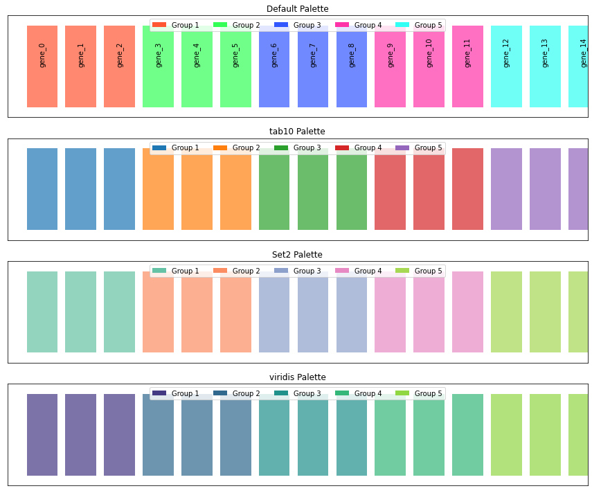

# Semi Random Collection of functions


<!-- WARNING: THIS FILE WAS AUTOGENERATED! DO NOT EDIT! -->

    /opt/hostedtoolcache/Python/3.10.16/x64/lib/python3.10/site-packages/fastcore/docscrape.py:230: UserWarning: Unknown section Parameters:
      else: warn(msg)
    /opt/hostedtoolcache/Python/3.10.16/x64/lib/python3.10/site-packages/fastcore/docscrape.py:230: UserWarning: Unknown section Returns:
      else: warn(msg)

------------------------------------------------------------------------

<a
href="https://github.com/mtinti/ProjectUtility/blob/main/ProjectUtility/core.py#L16"
target="_blank" style="float:right; font-size:smaller">source</a>

### convert_palette_to_hex

>  convert_palette_to_hex (palette_name, n_colors)

*Convert a named color palette to hex color codes.*

------------------------------------------------------------------------

<a
href="https://github.com/mtinti/ProjectUtility/blob/main/ProjectUtility/core.py#L52"
target="_blank" style="float:right; font-size:smaller">source</a>

### create_group_color_mapping

>  create_group_color_mapping (items, group_size=3, palette=None,
>                                  palette_name=None,
>                                  return_color_to_group=False)

*Create a color mapping dictionary that assigns the same color to items
in groups.*

``` python
# Example usage with different palette options
def demonstrate_group_mapping_palettes():
    # Create a list of items
    items = [f'gene_{i}' for i in range(15)]
    
    # Create a figure with multiple palette examples
    
    fig, axes = plt.subplots(4, 1, figsize=(12, 10))
    
    # Example 1: Default palette
    color_map1, group_map1 = create_group_color_mapping(
        items, group_size=3, return_color_to_group=True
    )
    
    # Example 2: tab10 palette
    color_map2, group_map2 = create_group_color_mapping(
        items, group_size=3, palette_name='tab10', return_color_to_group=True
    )
    
    # Example 3: Set2 palette
    color_map3, group_map3 = create_group_color_mapping(
        items, group_size=3, palette_name='Set2', return_color_to_group=True
    )
    
    # Example 4: viridis palette
    color_map4, group_map4 = create_group_color_mapping(
        items, group_size=3, palette_name='viridis', return_color_to_group=True
    )
    
    # Plot all examples
    palettes = [
        ('Default Palette', color_map1, group_map1),
        ('tab10 Palette', color_map2, group_map2),
        ('Set2 Palette', color_map3, group_map3),
        ('viridis Palette', color_map4, group_map4)
    ]
    
    for i, (title, color_map, group_map) in enumerate(palettes):
        ax = axes[i]
        
        # Plot bars
        for j, item in enumerate(items):
            ax.barh(0, 0.8, left=j, height=0.8, color=color_map[item], alpha=0.7)
            if i == 0:  # Only add labels on the first plot
                ax.text(j+0.4, 0, item, rotation=90, ha='center', va='bottom')
        
        # Add legend
        
        legend_elements = [Patch(facecolor=color, label=group) for color, group in group_map.items()]
        ax.legend(handles=legend_elements, loc='upper center', ncol=len(group_map))
        
        ax.set_ylim(-0.5, 0.5)
        ax.set_xlim(-0.5, len(items) - 0.5)
        ax.set_yticks([])
        ax.set_xticks([])
        ax.set_title(title)
    
    plt.tight_layout()
    
    # Print example of hex colors from tab10
    print("Example hex colors from tab10 palette:")
    for color in list(group_map2.keys())[:5]:
        print(color)
    
    return fig, axes
```

``` python
demonstrate_group_mapping_palettes()
```

    Example hex colors from tab10 palette:
    #1f77b4
    #ff7f0e
    #2ca02c
    #d62728
    #9467bd

    (<Figure size 864x720 with 4 Axes>,
     array([<AxesSubplot:title={'center':'Default Palette'}>,
            <AxesSubplot:title={'center':'tab10 Palette'}>,
            <AxesSubplot:title={'center':'Set2 Palette'}>,
            <AxesSubplot:title={'center':'viridis Palette'}>], dtype=object))



------------------------------------------------------------------------

<a
href="https://github.com/mtinti/ProjectUtility/blob/main/ProjectUtility/core.py#L176"
target="_blank" style="float:right; font-size:smaller">source</a>

### norm_loading_TMT

>  norm_loading_TMT (df)

------------------------------------------------------------------------

<a
href="https://github.com/mtinti/ProjectUtility/blob/main/ProjectUtility/core.py#L159"
target="_blank" style="float:right; font-size:smaller">source</a>

### quantileNormalize

>  quantileNormalize (df_input, keep_na=True)

------------------------------------------------------------------------

<a
href="https://github.com/mtinti/ProjectUtility/blob/main/ProjectUtility/core.py#L144"
target="_blank" style="float:right; font-size:smaller">source</a>

### norm_loading

>  norm_loading (df)

*normalization loading for the columns of a dataframe the columns shuld
be comparable (ie do not mix fractionated samples, for example cytosolic
and extracellulars)*

------------------------------------------------------------------------

<a
href="https://github.com/mtinti/ProjectUtility/blob/main/ProjectUtility/core.py#L190"
target="_blank" style="float:right; font-size:smaller">source</a>

### ires_norm

>  ires_norm (df, exps_columns)

*implement IRES norm for TMT example irs_df =
ires_norm(df.replace(0,np.nan).fillna(df.mean()),\[tmt10, tmt6\])
remember to set nan again after norm
irs_df\[df.replace(0,np.nan).isna()\]=np.nan*

------------------------------------------------------------------------

<a
href="https://github.com/mtinti/ProjectUtility/blob/main/ProjectUtility/core.py#L231"
target="_blank" style="float:right; font-size:smaller">source</a>

### clean_id

>  clean_id (temp_id)

------------------------------------------------------------------------

<a
href="https://github.com/mtinti/ProjectUtility/blob/main/ProjectUtility/core.py#L240"
target="_blank" style="float:right; font-size:smaller">source</a>

### hist_legend

>  hist_legend (ax, title=False)

------------------------------------------------------------------------

<a
href="https://github.com/mtinti/ProjectUtility/blob/main/ProjectUtility/core.py#L270"
target="_blank" style="float:right; font-size:smaller">source</a>

### add_desc

>  add_desc (data, prot_to_desc)

------------------------------------------------------------------------

<a
href="https://github.com/mtinti/ProjectUtility/blob/main/ProjectUtility/core.py#L247"
target="_blank" style="float:right; font-size:smaller">source</a>

### parse_fasta_file

>  parse_fasta_file (fasta_file)

*create a dictionary of protein id to gene product using fasta file from
tritrypDB*

------------------------------------------------------------------------

<a
href="https://github.com/mtinti/ProjectUtility/blob/main/ProjectUtility/core.py#L284"
target="_blank" style="float:right; font-size:smaller">source</a>

### get_scaled_df

>  get_scaled_df (df)
