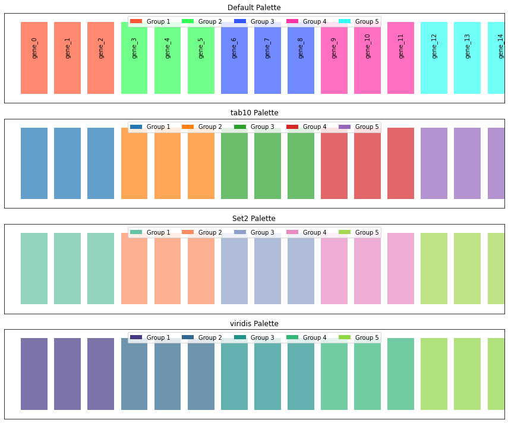
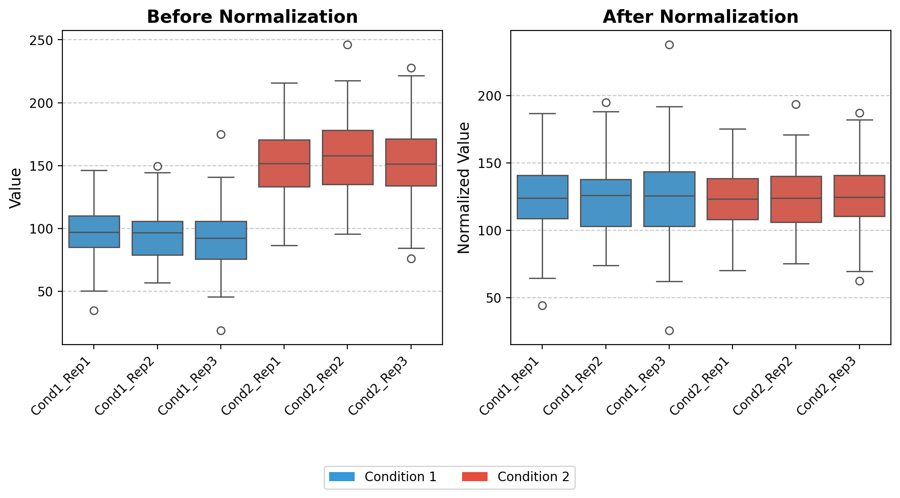
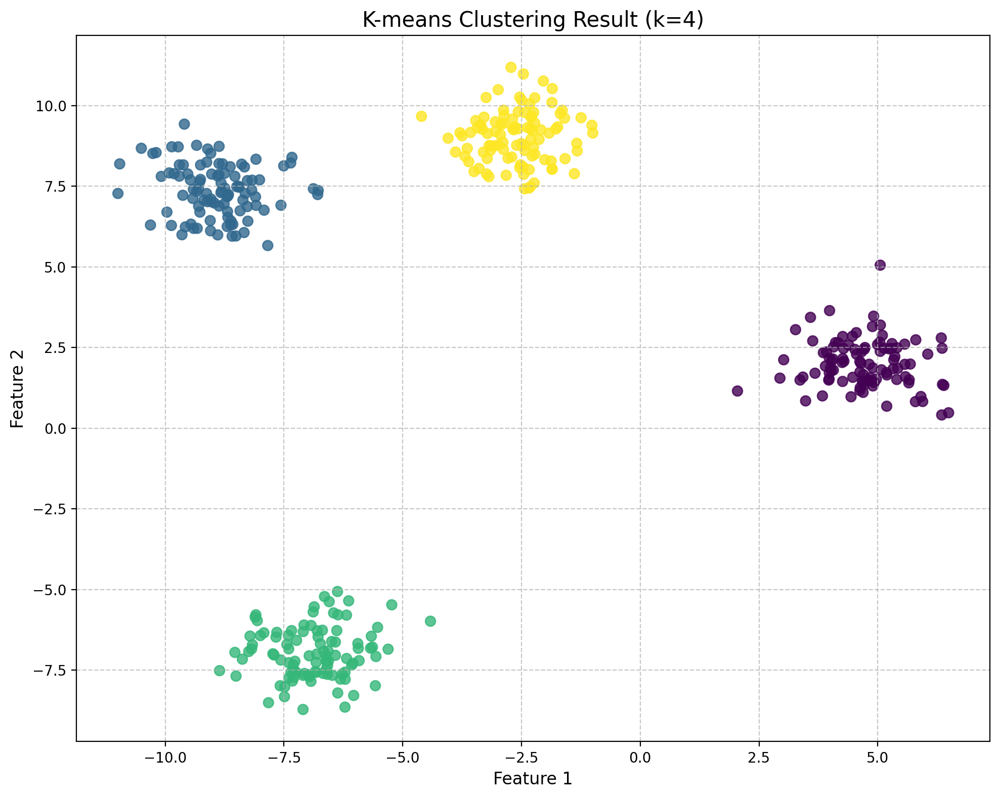

# Semi Random Collection of functions


<!-- WARNING: THIS FILE WAS AUTOGENERATED! DO NOT EDIT! -->

------------------------------------------------------------------------

<a
href="https://github.com/mtinti/ProjectUtility/blob/main/ProjectUtility/core.py#L26"
target="_blank" style="float:right; font-size:smaller">source</a>

### convert_palette_to_hex

>  convert_palette_to_hex (palette_name, n_colors)

*Convert a named color palette to hex color codes.*

------------------------------------------------------------------------

<a
href="https://github.com/mtinti/ProjectUtility/blob/main/ProjectUtility/core.py#L62"
target="_blank" style="float:right; font-size:smaller">source</a>

### create_group_color_mapping

>  create_group_color_mapping (items, group_size=3, palette=None,
>                                  palette_name=None,
>                                  return_color_to_group=False)

*Create a color mapping dictionary that assigns the same color to items
in groups.*

``` python
# Example usage with different palette options
def demonstrate_group_mapping_palettes():
    # Create a list of items
    items = [f'gene_{i}' for i in range(15)]
    
    # Create a figure with multiple palette examples
    
    fig, axes = plt.subplots(4, 1, figsize=(12, 10))
    
    # Example 1: Default palette
    color_map1, group_map1 = create_group_color_mapping(
        items, group_size=3, return_color_to_group=True
    )
    
    # Example 2: tab10 palette
    color_map2, group_map2 = create_group_color_mapping(
        items, group_size=3, palette_name='tab10', return_color_to_group=True
    )
    
    # Example 3: Set2 palette
    color_map3, group_map3 = create_group_color_mapping(
        items, group_size=3, palette_name='Set2', return_color_to_group=True
    )
    
    # Example 4: viridis palette
    color_map4, group_map4 = create_group_color_mapping(
        items, group_size=3, palette_name='viridis', return_color_to_group=True
    )
    
    # Plot all examples
    palettes = [
        ('Default Palette', color_map1, group_map1),
        ('tab10 Palette', color_map2, group_map2),
        ('Set2 Palette', color_map3, group_map3),
        ('viridis Palette', color_map4, group_map4)
    ]
    
    for i, (title, color_map, group_map) in enumerate(palettes):
        ax = axes[i]
        
        # Plot bars
        for j, item in enumerate(items):
            ax.barh(0, 0.8, left=j, height=0.8, color=color_map[item], alpha=0.7)
            if i == 0:  # Only add labels on the first plot
                ax.text(j+0.4, 0, item, rotation=90, ha='center', va='bottom')
        
        # Add legend
        
        legend_elements = [Patch(facecolor=color, label=group) for color, group in group_map.items()]
        ax.legend(handles=legend_elements, loc='upper center', ncol=len(group_map))
        
        ax.set_ylim(-0.5, 0.5)
        ax.set_xlim(-0.5, len(items) - 0.5)
        ax.set_yticks([])
        ax.set_xticks([])
        ax.set_title(title)
    
    plt.tight_layout()
    
    # Print example of hex colors from tab10
    print("Example hex colors from tab10 palette:")
    for color in list(group_map2.keys())[:5]:
        print(color)
    
    return fig, axes
```

``` python
demonstrate_group_mapping_palettes()
```

    Example hex colors from tab10 palette:
    #1f77b4
    #ff7f0e
    #2ca02c
    #d62728
    #9467bd

    (<Figure size 864x720 with 4 Axes>,
     array([<Axes: title={'center': 'Default Palette'}>,
            <Axes: title={'center': 'tab10 Palette'}>,
            <Axes: title={'center': 'Set2 Palette'}>,
            <Axes: title={'center': 'viridis Palette'}>], dtype=object))



------------------------------------------------------------------------

<a
href="https://github.com/mtinti/ProjectUtility/blob/main/ProjectUtility/core.py#L159"
target="_blank" style="float:right; font-size:smaller">source</a>

### norm_loading

>  norm_loading (df)

\*Normalize datasets by equalizing the medians of all columns to a
common target value.

This function implements a median normalization strategy that: 1.
Calculates the median value for each column in the input dataframe 2.
Computes a target value (the mean of all column medians) 3. Derives
normalization factors to adjust each column to the target median 4.
Applies these normalization factors to create a normalized dataset\*

``` python
# Set random seed for reproducibility
np.random.seed(42)

# Generate synthetic data with controlled medians
# Creating a dataset with 100 features (rows) and 6 samples (columns)
# - 3 replicates for condition 1 (lower median)
# - 3 replicates for condition 2 (higher median)

# Number of features (e.g., proteins, genes)
n_features = 100

# Create condition 1 data (3 replicates with similar distribution)
condition1_rep1 = np.random.normal(loc=100, scale=25, size=n_features)
condition1_rep2 = np.random.normal(loc=95, scale=20, size=n_features)
condition1_rep3 = np.random.normal(loc=90, scale=22, size=n_features)

# Create condition 2 data (3 replicates with higher median)
condition2_rep1 = np.random.normal(loc=150, scale=30, size=n_features)
condition2_rep2 = np.random.normal(loc=160, scale=28, size=n_features)
condition2_rep3 = np.random.normal(loc=155, scale=32, size=n_features)

# Create a DataFrame
data = pd.DataFrame({
    'Cond1_Rep1': condition1_rep1,
    'Cond1_Rep2': condition1_rep2,
    'Cond1_Rep3': condition1_rep3,
    'Cond2_Rep1': condition2_rep1,
    'Cond2_Rep2': condition2_rep2,
    'Cond2_Rep3': condition2_rep3
})

# Apply the normalization function
data_normalized = norm_loading(data)

# Set up the figure for visualization
fig, (ax1, ax2) = plt.subplots(1, 2, figsize=(10, 6))

# Color mapping for conditions
colors = ['#3498db', '#e74c3c']  # Blue for Condition 1, Red for Condition 2
condition_colors = {
    'Cond1_Rep1': colors[0], 'Cond1_Rep2': colors[0], 'Cond1_Rep3': colors[0],
    'Cond2_Rep1': colors[1], 'Cond2_Rep2': colors[1], 'Cond2_Rep3': colors[1]
}

# 1. Boxplot for raw data (before normalization)
ax1.set_title('Before Normalization', fontsize=14, fontweight='bold')
sns.boxplot(data=data, ax=ax1, palette=condition_colors)
# Get current tick positions
ax1_ticks = ax1.get_xticks()
ax1_labels = [label.get_text() for label in ax1.get_xticklabels()]
# Set ticks and then ticklabels
ax1.set_xticks(ax1_ticks)
ax1.set_xticklabels(ax1_labels, rotation=45, ha='right')
ax1.set_ylabel('Value', fontsize=12)
ax1.grid(axis='y', linestyle='--', alpha=0.7)

# 2. Boxplot for normalized data
ax2.set_title('After Normalization', fontsize=14, fontweight='bold')
sns.boxplot(data=data_normalized, ax=ax2, palette=condition_colors)
# Get current tick positions
ax2_ticks = ax2.get_xticks()
ax2_labels = [label.get_text() for label in ax2.get_xticklabels()]
# Set ticks and then ticklabels
ax2.set_xticks(ax2_ticks)
ax2.set_xticklabels(ax2_labels, rotation=45,ha='right')
ax2.set_ylabel('Normalized Value', fontsize=12)
ax2.grid(axis='y', linestyle='--', alpha=0.7)


# Create a custom legend for conditions
from matplotlib.patches import Patch
legend_elements = [
    Patch(facecolor=colors[0], label='Condition 1'),
    Patch(facecolor=colors[1], label='Condition 2')
]
fig.legend(handles=legend_elements, loc='upper center', bbox_to_anchor=(0.5, 0.05), ncol=2)

# Adjust layout to make room for annotations
plt.tight_layout(rect=[0, 0.1, 1, 0.9])
plt.show()
```

    medians [ 96.82609271  96.6821434   92.14930633 151.50472099 157.87481208
     151.45188746]
    target 124.41482716043556
    norm_facs [1.28493078 1.28684391 1.35014394 0.82119439 0.78806002 0.82148086]


------------------------------------------------------------------------

<a
href="https://github.com/mtinti/ProjectUtility/blob/main/ProjectUtility/core.py#L207"
target="_blank" style="float:right; font-size:smaller">source</a>

### quantileNormalize

>  quantileNormalize (df_input, keep_na=True)

\*Perform quantile normalization on a pandas DataFrame.

Quantile normalization is a technique that makes the distribution of
values for each column identical by transforming the values to match the
distribution of the mean of quantiles across all columns.

Algorithm: 1. Sort values in each column independently 2. Calculate the
mean across rows of the sorted data (creating a reference distribution)
3. For each original value, assign the corresponding value from the
reference distribution based on its rank in its original column\*

``` python
# Set random seed for reproducibility
np.random.seed(42)

# Generate synthetic data with controlled medians
# Creating a dataset with 100 features (rows) and 6 samples (columns)
# - 3 replicates for condition 1 (lower median)
# - 3 replicates for condition 2 (higher median)

# Number of features (e.g., proteins, genes)
n_features = 100

# Create condition 1 data (3 replicates with similar distribution)
condition1_rep1 = np.random.normal(loc=100, scale=25, size=n_features)
condition1_rep2 = np.random.normal(loc=95, scale=20, size=n_features)
condition1_rep3 = np.random.normal(loc=90, scale=22, size=n_features)

# Create condition 2 data (3 replicates with higher median)
condition2_rep1 = np.random.normal(loc=150, scale=30, size=n_features)
condition2_rep2 = np.random.normal(loc=160, scale=28, size=n_features)
condition2_rep3 = np.random.normal(loc=155, scale=32, size=n_features)

# Create a DataFrame
data = pd.DataFrame({
    'Cond1_Rep1': condition1_rep1,
    'Cond1_Rep2': condition1_rep2,
    'Cond1_Rep3': condition1_rep3,
    'Cond2_Rep1': condition2_rep1,
    'Cond2_Rep2': condition2_rep2,
    'Cond2_Rep3': condition2_rep3
})

# Apply the normalization function
data_normalized = quantileNormalize(data)

# Set up the figure for visualization
fig, (ax1, ax2) = plt.subplots(1, 2, figsize=(10, 6))

# Color mapping for conditions
colors = ['#3498db', '#e74c3c']  # Blue for Condition 1, Red for Condition 2
condition_colors = {
    'Cond1_Rep1': colors[0], 'Cond1_Rep2': colors[0], 'Cond1_Rep3': colors[0],
    'Cond2_Rep1': colors[1], 'Cond2_Rep2': colors[1], 'Cond2_Rep3': colors[1]
}

# 1. Boxplot for raw data (before normalization)
ax1.set_title('Before Normalization', fontsize=14, fontweight='bold')
sns.boxplot(data=data, ax=ax1, palette=condition_colors)
# Get current tick positions
ax1_ticks = ax1.get_xticks()
ax1_labels = [label.get_text() for label in ax1.get_xticklabels()]
# Set ticks and then ticklabels
ax1.set_xticks(ax1_ticks)
ax1.set_xticklabels(ax1_labels, rotation=45, ha='right')
ax1.set_ylabel('Value', fontsize=12)
ax1.grid(axis='y', linestyle='--', alpha=0.7)

# 2. Boxplot for normalized data
ax2.set_title('After Normalization', fontsize=14, fontweight='bold')
sns.boxplot(data=data_normalized, ax=ax2, palette=condition_colors)
# Get current tick positions
ax2_ticks = ax2.get_xticks()
ax2_labels = [label.get_text() for label in ax2.get_xticklabels()]
# Set ticks and then ticklabels
ax2.set_xticks(ax2_ticks)
ax2.set_xticklabels(ax2_labels, rotation=45,ha='right')
ax2.set_ylabel('Normalized Value', fontsize=12)
ax2.grid(axis='y', linestyle='--', alpha=0.7)


# Create a custom legend for conditions
from matplotlib.patches import Patch
legend_elements = [
    Patch(facecolor=colors[0], label='Condition 1'),
    Patch(facecolor=colors[1], label='Condition 2')
]
fig.legend(handles=legend_elements, loc='upper center', bbox_to_anchor=(0.5, 0.05), ncol=2)

# Adjust layout to make room for annotations
plt.tight_layout(rect=[0, 0.1, 1, 0.9])
plt.show()
```


------------------------------------------------------------------------

<a
href="https://github.com/mtinti/ProjectUtility/blob/main/ProjectUtility/core.py#L276"
target="_blank" style="float:right; font-size:smaller">source</a>

### norm_loading_TMT

>  norm_loading_TMT (df)

\*Normalize TMT (Tandem Mass Tag) proteomics data to account for uneven
sample loading.

This function performs total sum normalization, specifically designed
for TMT-based multiplexed proteomics experiments where differences in
total protein abundance between samples may be due to technical
variations rather than biological differences.\*

``` python
# Set random seed for reproducibility
np.random.seed(42)

# Generate synthetic data with controlled medians
# Creating a dataset with 100 features (rows) and 6 samples (columns)
# - 3 replicates for condition 1 (lower median)
# - 3 replicates for condition 2 (higher median)

# Number of features (e.g., proteins, genes)
n_features = 100

# Create condition 1 data (3 replicates with similar distribution)
condition1_rep1 = np.random.normal(loc=100, scale=25, size=n_features)
condition1_rep2 = np.random.normal(loc=95, scale=20, size=n_features)
condition1_rep3 = np.random.normal(loc=90, scale=22, size=n_features)

# Create condition 2 data (3 replicates with higher median)
condition2_rep1 = np.random.normal(loc=150, scale=30, size=n_features)
condition2_rep2 = np.random.normal(loc=160, scale=28, size=n_features)
condition2_rep3 = np.random.normal(loc=155, scale=32, size=n_features)

# Create a DataFrame
data = pd.DataFrame({
    'Cond1_Rep1': condition1_rep1,
    'Cond1_Rep2': condition1_rep2,
    'Cond1_Rep3': condition1_rep3,
    'Cond2_Rep1': condition2_rep1,
    'Cond2_Rep2': condition2_rep2,
    'Cond2_Rep3': condition2_rep3
})

# Apply the normalization function
data_normalized = norm_loading_TMT(data)

# Set up the figure for visualization
fig, (ax1, ax2) = plt.subplots(1, 2, figsize=(10, 6))

# Color mapping for conditions
colors = ['#3498db', '#e74c3c']  # Blue for Condition 1, Red for Condition 2
condition_colors = {
    'Cond1_Rep1': colors[0], 'Cond1_Rep2': colors[0], 'Cond1_Rep3': colors[0],
    'Cond2_Rep1': colors[1], 'Cond2_Rep2': colors[1], 'Cond2_Rep3': colors[1]
}

# 1. Boxplot for raw data (before normalization)
ax1.set_title('Before Normalization', fontsize=14, fontweight='bold')
sns.boxplot(data=data, ax=ax1, palette=condition_colors)
# Get current tick positions
ax1_ticks = ax1.get_xticks()
ax1_labels = [label.get_text() for label in ax1.get_xticklabels()]
# Set ticks and then ticklabels
ax1.set_xticks(ax1_ticks)
ax1.set_xticklabels(ax1_labels, rotation=45, ha='right')
ax1.set_ylabel('Value', fontsize=12)
ax1.grid(axis='y', linestyle='--', alpha=0.7)

# 2. Boxplot for normalized data
ax2.set_title('After Normalization', fontsize=14, fontweight='bold')
sns.boxplot(data=data_normalized, ax=ax2, palette=condition_colors)
# Get current tick positions
ax2_ticks = ax2.get_xticks()
ax2_labels = [label.get_text() for label in ax2.get_xticklabels()]
# Set ticks and then ticklabels
ax2.set_xticks(ax2_ticks)
ax2.set_xticklabels(ax2_labels, rotation=45,ha='right')
ax2.set_ylabel('Normalized Value', fontsize=12)
ax2.grid(axis='y', linestyle='--', alpha=0.7)


# Create a custom legend for conditions
from matplotlib.patches import Patch
legend_elements = [
    Patch(facecolor=colors[0], label='Condition 1'),
    Patch(facecolor=colors[1], label='Condition 2')
]
fig.legend(handles=legend_elements, loc='upper center', bbox_to_anchor=(0.5, 0.05), ncol=2)

# Adjust layout to make room for annotations
plt.tight_layout(rect=[0, 0.1, 1, 0.9])
plt.show()
```



------------------------------------------------------------------------

<a
href="https://github.com/mtinti/ProjectUtility/blob/main/ProjectUtility/core.py#L349"
target="_blank" style="float:right; font-size:smaller">source</a>

### ires_norm

>  ires_norm (df, exps_columns)

\*Implement Internal Reference Scaling (IRS) normalization for combining
multiple TMT experiments.

This function normalizes and integrates data from multiple TMT
experiments by: 1. Computing the sum of each protein’s intensity across
all channels within each experiment 2. Calculating the geometric mean of
these sums across experiments (reference value) 3. Deriving scaling
factors to adjust each experiment to this reference 4. Applying an
additional total sum normalization to the combined dataset\*

``` python
# Set random seed for reproducibility
np.random.seed(42)

# Generate synthetic data with controlled medians
# Creating a dataset with 100 features (rows) and 6 samples (columns)
# - 3 replicates for condition 1 (lower median)
# - 3 replicates for condition 2 (higher median)

# Number of features (e.g., proteins, genes)
n_features = 100

# Create condition 1 data (3 replicates with similar distribution)
condition1_rep1 = np.random.normal(loc=100, scale=25, size=n_features)
condition1_rep2 = np.random.normal(loc=95, scale=20, size=n_features)
condition1_rep3 = np.random.normal(loc=90, scale=22, size=n_features)

# Create condition 2 data (3 replicates with higher median)
condition2_rep1 = np.random.normal(loc=150, scale=30, size=n_features)
condition2_rep2 = np.random.normal(loc=160, scale=28, size=n_features)
condition2_rep3 = np.random.normal(loc=155, scale=32, size=n_features)

# Create a DataFrame
data = pd.DataFrame({
    'Cond1_Rep1': condition1_rep1,
    'Cond1_Rep2': condition1_rep2,
    'Cond1_Rep3': condition1_rep3,
    'Cond2_Rep1': condition2_rep1,
    'Cond2_Rep2': condition2_rep2,
    'Cond2_Rep3': condition2_rep3
})

# Apply the normalization function
data_normalized = ires_norm(data,[['Cond1_Rep1','Cond1_Rep2','Cond1_Rep3' ],['Cond2_Rep1','Cond2_Rep2','Cond2_Rep3' ]])

# Set up the figure for visualization
fig, (ax1, ax2) = plt.subplots(1, 2, figsize=(10, 6))

# Color mapping for conditions
colors = ['#3498db', '#e74c3c']  # Blue for Condition 1, Red for Condition 2
condition_colors = {
    'Cond1_Rep1': colors[0], 'Cond1_Rep2': colors[0], 'Cond1_Rep3': colors[0],
    'Cond2_Rep1': colors[1], 'Cond2_Rep2': colors[1], 'Cond2_Rep3': colors[1]
}

# 1. Boxplot for raw data (before normalization)
ax1.set_title('Before Normalization', fontsize=14, fontweight='bold')
sns.boxplot(data=data, ax=ax1, palette=condition_colors)
# Get current tick positions
ax1_ticks = ax1.get_xticks()
ax1_labels = [label.get_text() for label in ax1.get_xticklabels()]
# Set ticks and then ticklabels
ax1.set_xticks(ax1_ticks)
ax1.set_xticklabels(ax1_labels, rotation=45, ha='right')
ax1.set_ylabel('Value', fontsize=12)
ax1.grid(axis='y', linestyle='--', alpha=0.7)

# 2. Boxplot for normalized data
ax2.set_title('After Normalization', fontsize=14, fontweight='bold')
sns.boxplot(data=data_normalized, ax=ax2, palette=condition_colors)
# Get current tick positions
ax2_ticks = ax2.get_xticks()
ax2_labels = [label.get_text() for label in ax2.get_xticklabels()]
# Set ticks and then ticklabels
ax2.set_xticks(ax2_ticks)
ax2.set_xticklabels(ax2_labels, rotation=45,ha='right')
ax2.set_ylabel('Normalized Value', fontsize=12)
ax2.grid(axis='y', linestyle='--', alpha=0.7)


# Create a custom legend for conditions
from matplotlib.patches import Patch
legend_elements = [
    Patch(facecolor=colors[0], label='Condition 1'),
    Patch(facecolor=colors[1], label='Condition 2')
]
fig.legend(handles=legend_elements, loc='upper center', bbox_to_anchor=(0.5, 0.05), ncol=2)

# Adjust layout to make room for annotations
plt.tight_layout(rect=[0, 0.1, 1, 0.9])
plt.show()
```


------------------------------------------------------------------------

<a
href="https://github.com/mtinti/ProjectUtility/blob/main/ProjectUtility/core.py#L444"
target="_blank" style="float:right; font-size:smaller">source</a>

### clean_id

>  clean_id (temp_id)

------------------------------------------------------------------------

<a
href="https://github.com/mtinti/ProjectUtility/blob/main/ProjectUtility/core.py#L451"
target="_blank" style="float:right; font-size:smaller">source</a>

### mod_hist_legend

>  mod_hist_legend (ax, title=False)

*Creates a cleaner legend for histogram plots by using line elements
instead of patches. when using step Motivation: - Default histogram
legends show rectangle patches which can be visually distracting - This
function creates a more elegant legend with simple lines matching
histogram edge colors - Positions the legend outside the plot to avoid
overlapping with data*

``` python
# Create sample data for multiple distributions
np.random.seed(42)  # For reproducibility
data_a = np.random.normal(0, 1, 1000)
data_b = np.random.normal(3, 1.5, 1500)

# Create a figure with 2 subplots side by side
fig, (ax1, ax2) = plt.subplots(1, 2, figsize=(10, 4))

# Left subplot: Default histogram legend
ax1.hist(data_a, bins=30, alpha=0.7, label='Distribution A', edgecolor='blue', histtype='step')
ax1.hist(data_b, bins=30, alpha=0.7, label='Distribution B', edgecolor='red', histtype='step')
ax1.set_title('Default Legend')
ax1.legend()  # Default legend

# Right subplot: Modified histogram legend
ax2.hist(data_a, bins=30, alpha=0.7, label='Distribution A', edgecolor='blue', histtype='step')
ax2.hist(data_b, bins=30, alpha=0.7, label='Distribution B', edgecolor='red', histtype='step')
ax2.set_title('Modified Legend')
mod_hist_legend(ax2, title='Distributions')  # Apply our function

# Adjust layout to give space for the right-side legend
plt.tight_layout()
fig.subplots_adjust(right=0.85)

# Display the figure
plt.show()
```


------------------------------------------------------------------------

<a
href="https://github.com/mtinti/ProjectUtility/blob/main/ProjectUtility/core.py#L488"
target="_blank" style="float:right; font-size:smaller">source</a>

### clean_axes

>  clean_axes (ax, offset=10)

*Customizes a matplotlib axes by removing top and right spines, and
creating a broken axis effect where x and y axes don’t touch.*

``` python
# Create sample data for multiple distributions
np.random.seed(42)  # For reproducibility
data_a = np.random.normal(0, 1, 1000)
data_b = np.random.normal(3, 1.5, 1500)

# Create a figure with 2 subplots side by side
fig, (ax1, ax2) = plt.subplots(1, 2, figsize=(10, 4))

# Left subplot: Default histogram legend
ax1.hist(data_a, bins=30, alpha=0.7, label='Distribution A', edgecolor='blue', histtype='step')
ax1.hist(data_b, bins=30, alpha=0.7, label='Distribution B', edgecolor='red', histtype='step')
ax1.set_title('Default Legend')
ax1.legend()  # Default legend

# Right subplot: Modified histogram legend
ax2.hist(data_a, bins=30, alpha=0.7, label='Distribution A', edgecolor='blue', histtype='step')
ax2.hist(data_b, bins=30, alpha=0.7, label='Distribution B', edgecolor='red', histtype='step')
ax2.set_title('Modified Axes')
mod_hist_legend(ax2, title='Distributions')  # Apply our function
clean_axes(ax2)
# Adjust layout to give space for the right-side legend
plt.tight_layout()
fig.subplots_adjust(right=0.85)

# Display the figure
plt.show()
```


------------------------------------------------------------------------

<a
href="https://github.com/mtinti/ProjectUtility/blob/main/ProjectUtility/core.py#L547"
target="_blank" style="float:right; font-size:smaller">source</a>

### add_desc

>  add_desc (data, prot_to_desc)

------------------------------------------------------------------------

<a
href="https://github.com/mtinti/ProjectUtility/blob/main/ProjectUtility/core.py#L524"
target="_blank" style="float:right; font-size:smaller">source</a>

### parse_fasta_file

>  parse_fasta_file (fasta_file)

*create a dictionary of protein id to gene product using fasta file from
tritrypDB*

------------------------------------------------------------------------

<a
href="https://github.com/mtinti/ProjectUtility/blob/main/ProjectUtility/core.py#L559"
target="_blank" style="float:right; font-size:smaller">source</a>

### get_scaled_df

>  get_scaled_df (df)

------------------------------------------------------------------------

<a
href="https://github.com/mtinti/ProjectUtility/blob/main/ProjectUtility/core.py#L724"
target="_blank" style="float:right; font-size:smaller">source</a>

### elbow_point

>  elbow_point (values)

*Find the elbow point in a curve using the maximum curvature method.*

<table>
<thead>
<tr>
<th></th>
<th><strong>Type</strong></th>
<th><strong>Details</strong></th>
</tr>
</thead>
<tbody>
<tr>
<td>values</td>
<td>list</td>
<td>The y-values of the curve.</td>
</tr>
<tr>
<td><strong>Returns</strong></td>
<td><strong>int</strong></td>
<td><strong>The index of the elbow point.</strong></td>
</tr>
</tbody>
</table>

------------------------------------------------------------------------

<a
href="https://github.com/mtinti/ProjectUtility/blob/main/ProjectUtility/core.py#L576"
target="_blank" style="float:right; font-size:smaller">source</a>

### kmeans_cluster_analysis

>  kmeans_cluster_analysis (df, cluster_sizes, random_state=42,
>                               features=None, figsize=(12, 6),
>                               standardize=False, fill_na=False)

*Perform K-means clustering analysis on a pandas DataFrame and visualize
the results with both normalized inertia and silhouette scores on the
same plot.*

<table>
<colgroup>
<col style="width: 6%" />
<col style="width: 25%" />
<col style="width: 34%" />
<col style="width: 34%" />
</colgroup>
<thead>
<tr>
<th></th>
<th><strong>Type</strong></th>
<th><strong>Default</strong></th>
<th><strong>Details</strong></th>
</tr>
</thead>
<tbody>
<tr>
<td>df</td>
<td>pandas.DataFrame</td>
<td></td>
<td>The input data to cluster.</td>
</tr>
<tr>
<td>cluster_sizes</td>
<td>list</td>
<td></td>
<td>List of cluster sizes (k values) to evaluate.</td>
</tr>
<tr>
<td>random_state</td>
<td>int</td>
<td>42</td>
<td>Random seed for reproducibility (default: 42).</td>
</tr>
<tr>
<td>features</td>
<td>NoneType</td>
<td>None</td>
<td>List of column names to use for clustering. If None, all columns are
used.</td>
</tr>
<tr>
<td>figsize</td>
<td>tuple</td>
<td>(12, 6)</td>
<td>Figure size for the output plot (default: (12, 6)).</td>
</tr>
<tr>
<td>standardize</td>
<td>bool</td>
<td>False</td>
<td>Whether to standardize the features (default: False).</td>
</tr>
<tr>
<td>fill_na</td>
<td>bool</td>
<td>False</td>
<td>Whether to fill missing values with column means (default:
False).</td>
</tr>
<tr>
<td><strong>Returns</strong></td>
<td><strong>tuple</strong></td>
<td></td>
<td><strong>(figure, inertia_values, silhouette_values) - The matplotlib
figure object,<br>the list of inertia values, and the list of silhouette
scores.</strong></td>
</tr>
</tbody>
</table>

``` python
import numpy as np
import pandas as pd
import matplotlib.pyplot as plt
from sklearn.datasets import make_blobs

# Create synthetic dataset with 4 natural clusters
X, y = make_blobs(
    n_samples=400, 
    centers=4, 
    cluster_std=0.8, 
    random_state=42
)

# Convert to DataFrame
df = pd.DataFrame(X, columns=['feature1', 'feature2'])

# Print basic information about the dataset
print(f"Dataset shape: {df.shape}")
print(df.head())

# Define the range of cluster sizes to test
cluster_sizes = list(range(1, 11))  # Test k from 1 to 10

# Run the kmeans cluster analysis
fig, ax, inertia_values, silhouette_values = kmeans_cluster_analysis(
    df=df,
    cluster_sizes=cluster_sizes,
    random_state=42,
    standardize=True,  # Standardize the features
    figsize=(12, 7)
)

# Now you can further customize the plot using the ax object
ax.set_facecolor('#f8f9fa')  # Light gray background
ax.set_title('K-means Clustering Analysis for Synthetic Data', fontsize=16, fontweight='bold')

# Display the generated plot
plt.show()

# Print the actual optimal number of clusters (which should be 4 in this case)
print("\nInertia values:")
for k, inertia in zip(cluster_sizes, inertia_values):
    print(f"k={k}: {inertia:.2f}")

print("\nSilhouette scores:")
for k, silhouette in zip(cluster_sizes, silhouette_values):
    if k > 1:  # Silhouette score not defined for k=1
        print(f"k={k}: {silhouette:.4f}")

# Create a scatter plot of the data with the optimal cluster assignment (k=4)
from sklearn.cluster import KMeans
from sklearn.preprocessing import StandardScaler

# Standardize the data
scaler = StandardScaler()
X_scaled = scaler.fit_transform(df)

# Fit KMeans with k=4
kmeans = KMeans(n_clusters=4, random_state=42, n_init=10)
labels = kmeans.fit_predict(X_scaled)

# Create a scatter plot with cluster assignments using fig, ax
fig, ax = plt.subplots(figsize=(10, 8))
scatter = ax.scatter(X[:, 0], X[:, 1], c=labels, cmap='viridis', s=50, alpha=0.8)
ax.set_title('K-means Clustering Result (k=4)', fontsize=15)
ax.set_xlabel('Feature 1', fontsize=12)
ax.set_ylabel('Feature 2', fontsize=12)
ax.grid(True, linestyle='--', alpha=0.7)
fig.tight_layout()

plt.show()

# Verify the implementation by comparing with manually calculated metrics
# For k=4, calculate inertia manually
manual_inertia = 0
for i, point in enumerate(X_scaled):
    centroid = kmeans.cluster_centers_[labels[i]]
    manual_inertia += np.sum((point - centroid) ** 2)

print(f"\nVerification for k=4:")
print(f"KMeans inertia: {kmeans.inertia_:.4f}")
print(f"Manually calculated inertia: {manual_inertia:.4f}")
```

    Dataset shape: (400, 2)
       feature1  feature2
    0 -9.862671  8.727358
    1 -4.604994  9.671808
    2 -9.034922  7.105344
    3  5.419975  1.855524
    4  5.096591  2.881622
    Standardizing features.

    Inertia values:
    k=1: 800.00
    k=2: 417.20
    k=3: 89.69
    k=4: 15.00
    k=5: 13.43
    k=6: 11.91
    k=7: 10.48
    k=8: 9.25
    k=9: 8.48
    k=10: 7.65

    Silhouette scores:
    k=2: 0.5702
    k=3: 0.7638
    k=4: 0.8403
    k=5: 0.7040
    k=6: 0.5770
    k=7: 0.4511
    k=8: 0.3408
    k=9: 0.3458
    k=10: 0.3538

    Verification for k=4:
    KMeans inertia: 14.9956
    Manually calculated inertia: 14.9956



