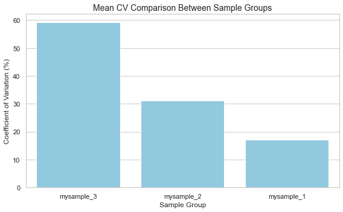
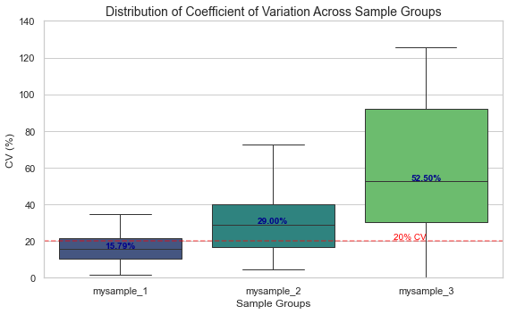

# Correlation Utilities for Replicated Samples


<!-- WARNING: THIS FILE WAS AUTOGENERATED! DO NOT EDIT! -->

> Overview

This notebook contains utility functions and workflows for analyzing
correlations between replicated samples in experimental data.

------------------------------------------------------------------------

<a
href="https://github.com/mtinti/ProjectUtility/blob/main/ProjectUtility/correlation_utilities.py#L16"
target="_blank" style="float:right; font-size:smaller">source</a>

### ReplicateAnalyzer

>  ReplicateAnalyzer (data:Optional[pandas.core.frame.DataFrame]=None,
>                         sample_groups:Optional[List[str]]=None)

\*A class for analyzing and visualizing correlations between replicated
samples.

This class provides utilities for assessing reproducibility and
reliability in experimental measurements, with a focus on correlation
metrics and visualization tools.\*

## Test Calss

``` python
# Set plotting style
sns.set_theme(style="whitegrid")
plt.rcParams['figure.figsize'] = (10, 6)

# Example data creation
np.random.seed(42)  # For reproducibility

# Create a sample dataframe with replicated measurements
# Let's say we have 100 genes measured across 2 sample groups with 3 replicates each
n_genes = 100

# Sample 1 replicates with moderate variability
s1_rep1 = np.random.lognormal(mean=2, sigma=0.2, size=n_genes)
s1_rep2 = np.random.lognormal(mean=2, sigma=0.2, size=n_genes)
s1_rep3 = np.random.lognormal(mean=2, sigma=0.2, size=n_genes)

# Sample 2 replicates with higher variability
s2_rep1 = np.random.lognormal(mean=1.5, sigma=0.4, size=n_genes)
s2_rep2 = np.random.lognormal(mean=1.5, sigma=0.4, size=n_genes)
s2_rep3 = np.random.lognormal(mean=1.5, sigma=0.4, size=n_genes)

# Create a third sample group with very high variability (for demonstration)
s3_rep1 = np.random.lognormal(mean=2, sigma=0.8, size=n_genes)
s3_rep2 = np.random.lognormal(mean=2, sigma=0.8, size=n_genes)

# Create dataframe
data = pd.DataFrame({
    'S1-Replica1': s1_rep1,
    'S1-Replica2': s1_rep2,
    'S1-Replica3': s1_rep3,
    'S2-Replica1': s2_rep1,
    'S2-Replica2': s2_rep2,
    'S2-Replica3': s2_rep3,
    'S3-Replica1': s3_rep1,
    'S3-Replica2': s3_rep2
})

# Define sample groups
sample_groups = ['mysample_1', 'mysample_1', 'mysample_1', 
                'mysample_2', 'mysample_2', 'mysample_2',
                'mysample_3', 'mysample_3']

# Initialize analyzer with data
analyzer = ReplicateAnalyzer(data, sample_groups)

# Calculate coefficient of variation (average across all measurements)
cv_results = analyzer.calculate_coefficient_of_variation()
print("Mean Coefficient of Variation Results:")
print(cv_results)

# Visualize the mean CV results as a bar plot
print("\nGenerating mean CV bar plot...")
fig1 = analyzer.plot_coefficient_of_variation(
    title="Mean CV Comparison Between Sample Groups",
    figsize=(8, 5)
)

# Get mapping of sample groups to column names
mapping = analyzer.get_sample_group_mapping()
print("\nSample Group Mapping:")
for group, columns in mapping.items():
    print(f"{group}: {columns}")

# Now use the new CV boxplot functionality to show the distribution of CV values
print("\nCalculating CV distribution...")
cv_distribution = analyzer.calculate_cv_distribution(exclude_zeros=True)

# Display summary statistics of the CV distribution
print("\nCV Distribution Summary Statistics:")
print(cv_distribution.describe())

# Create the CV boxplot
print("\nGenerating CV distribution boxplot...")
fig2 = analyzer.plot_cv_boxplot(
    min_y=0,  # Minimum y-axis value
    max_y=140,  # Maximum y-axis value
    figsize=(8, 5),
    color_palette="viridis",
    display_median=True,
    reference_line=20,  
    title="Distribution of Coefficient of Variation Across Sample Groups"
)

# Show plots
plt.tight_layout()
plt.show()
```

    Mean Coefficient of Variation Results:
    {'mysample_1': 17.080592807021713, 'mysample_2': 31.238071697274144, 'mysample_3': 59.19997632844498}

    Generating mean CV bar plot...

    Sample Group Mapping:
    mysample_1: ['S1-Replica1', 'S1-Replica2', 'S1-Replica3']
    mysample_2: ['S2-Replica1', 'S2-Replica2', 'S2-Replica3']
    mysample_3: ['S3-Replica1', 'S3-Replica2']

    Calculating CV distribution...

    CV Distribution Summary Statistics:
           mysample_1  mysample_2  mysample_3
    count  100.000000  100.000000  100.000000
    mean    17.080593   31.238072   59.199976
    std      9.291617   17.255365   34.850935
    min      1.571174    4.294527    0.111769
    25%     10.560251   16.585752   30.218940
    50%     15.791861   29.000638   52.498173
    75%     21.370398   39.970172   92.043385
    max     49.541067   72.443491  125.483679

    Generating CV distribution boxplot...





------------------------------------------------------------------------

<a
href="https://github.com/mtinti/ProjectUtility/blob/main/ProjectUtility/correlation_utilities.py#L385"
target="_blank" style="float:right; font-size:smaller">source</a>

### concordance_correlation_coefficient

>  concordance_correlation_coefficient (y_true, y_pred)

\*Calculate the concordance correlation coefficient (CCC).

The concordance correlation coefficient measures the agreement between
two variables, ranging from -1 to 1, where 1 represents perfect
agreement.\*

<table>
<colgroup>
<col style="width: 9%" />
<col style="width: 38%" />
<col style="width: 52%" />
</colgroup>
<thead>
<tr>
<th></th>
<th><strong>Type</strong></th>
<th><strong>Details</strong></th>
</tr>
</thead>
<tbody>
<tr>
<td>y_true</td>
<td>array-like</td>
<td>Ground truth values.</td>
</tr>
<tr>
<td>y_pred</td>
<td>array-like</td>
<td>Predicted values.</td>
</tr>
<tr>
<td><strong>Returns</strong></td>
<td><strong>float</strong></td>
<td><strong>Concordance correlation coefficient value between -1 and
1.<br>A value of 1 indicates perfect agreement between the true and
predicted values.</strong></td>
</tr>
</tbody>
</table>

``` python
y_true = [3, -0.5, 2, 7]
y_pred = [2.5, 0.0, 2, 8]
concordance_correlation_coefficient(y_true, y_pred)
#0.9767891682785301
```

    0.9767891682785301
