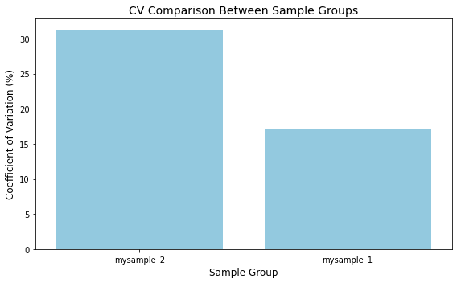

# Correlation Utilities for Replicated Samples


<!-- WARNING: THIS FILE WAS AUTOGENERATED! DO NOT EDIT! -->

> Overview

This notebook contains utility functions and workflows for analyzing
correlations between replicated samples in experimental data.

------------------------------------------------------------------------

<a
href="https://github.com/mtinti/ProjectUtility/blob/main/ProjectUtility/correlation_utilities.py#L15"
target="_blank" style="float:right; font-size:smaller">source</a>

### ReplicateAnalyzer

>  ReplicateAnalyzer (data:Optional[pandas.core.frame.DataFrame]=None,
>                         sample_groups:Optional[List[str]]=None)

\*A class for analyzing and visualizing correlations between replicated
samples.

This class provides utilities for assessing reproducibility and
reliability in experimental measurements, with a focus on correlation
metrics and visualization tools.\*

``` python
# Example data creation
np.random.seed(42)  # For reproducibility

# Create a sample dataframe with replicated measurements
# Let's say we have 100 genes measured across 2 sample groups with 3 replicates each
n_genes = 100

# Sample 1 replicates with moderate variability
s1_rep1 = np.random.lognormal(mean=2, sigma=0.2, size=n_genes)
s1_rep2 = np.random.lognormal(mean=2, sigma=0.2, size=n_genes)
s1_rep3 = np.random.lognormal(mean=2, sigma=0.2, size=n_genes)

# Sample 2 replicates with higher variability
s2_rep1 = np.random.lognormal(mean=1.5, sigma=0.4, size=n_genes)
s2_rep2 = np.random.lognormal(mean=1.5, sigma=0.4, size=n_genes)
s2_rep3 = np.random.lognormal(mean=1.5, sigma=0.4, size=n_genes)

# Create dataframe
data = pd.DataFrame({
    'S1-Replica1': s1_rep1,
    'S1-Replica2': s1_rep2,
    'S1-Replica3': s1_rep3,
    'S2-Replica1': s2_rep1,
    'S2-Replica2': s2_rep2,
    'S2-Replica3': s2_rep3
})

# Define sample groups
sample_groups = ['mysample_1', 'mysample_1', 'mysample_1', 
                'mysample_2', 'mysample_2', 'mysample_2']

# Initialize analyzer with data
analyzer = ReplicateAnalyzer(data, sample_groups)

# Calculate coefficient of variation
cv_results = analyzer.calculate_coefficient_of_variation()
print("Coefficient of Variation Results:")
print(cv_results)

# Visualize the results
fig = analyzer.plot_coefficient_of_variation(
    title="CV Comparison Between Sample Groups",
    figsize=(8, 5)
)

# Get mapping of sample groups to column names
mapping = analyzer.get_sample_group_mapping()
print("\nSample Group Mapping:")
for group, columns in mapping.items():
    print(f"{group}: {columns}")
```

    Coefficient of Variation Results:
    {'mysample_1': 17.080592807021713, 'mysample_2': 31.238071697274144}

    Sample Group Mapping:
    mysample_1: ['S1-Replica1', 'S1-Replica2', 'S1-Replica3']
    mysample_2: ['S2-Replica1', 'S2-Replica2', 'S2-Replica3']


