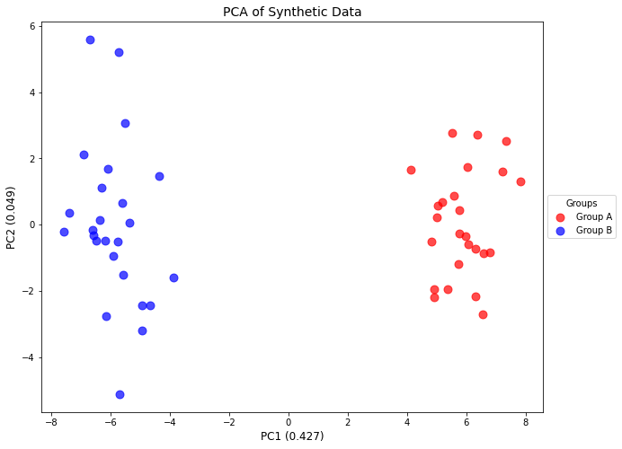
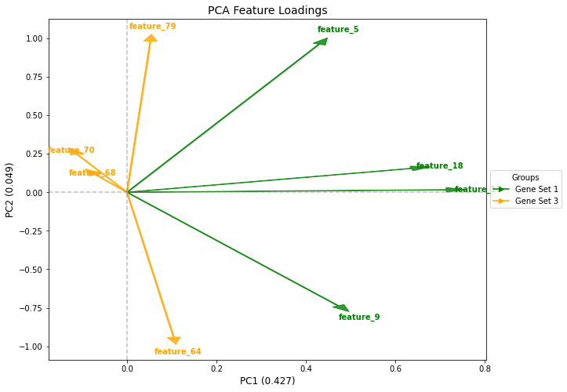
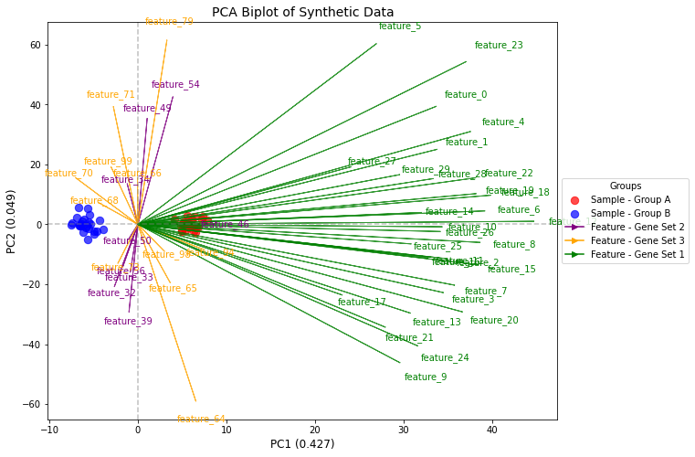
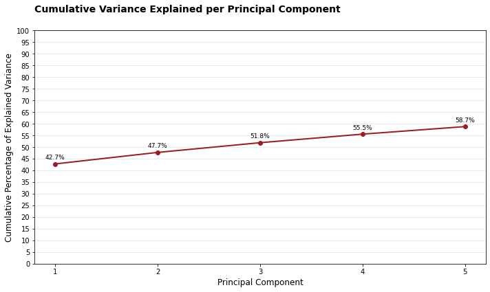
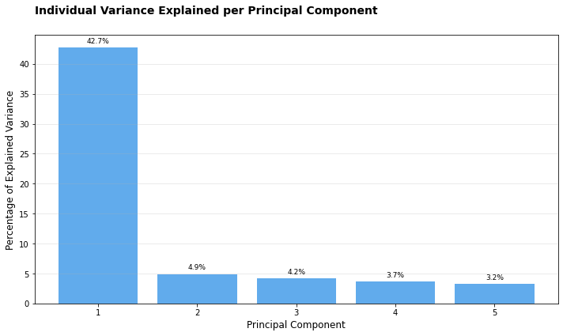
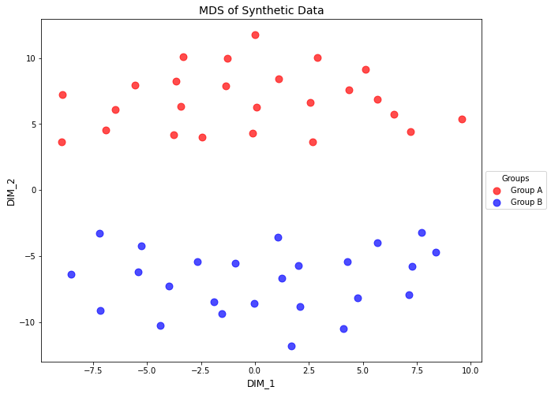
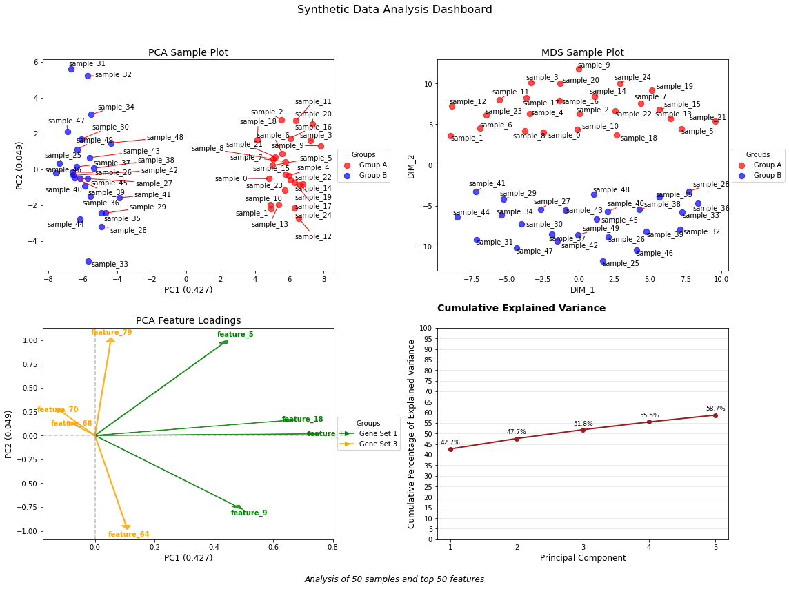

# Dimensionality Reduction Utilities


<!-- WARNING: THIS FILE WAS AUTOGENERATED! DO NOT EDIT! -->

> Flexible utilities for PCA, MDS, and biplots visualizations.

## The Plotter Class

This class provides a unified framework for dimensionality reduction
techniques, with a focus on visualization

------------------------------------------------------------------------

<a
href="https://github.com/mtinti/ProjectUtility/blob/main/ProjectUtility/dim_red_utility.py#L28"
target="_blank" style="float:right; font-size:smaller">source</a>

### DimensionalityReductionPlotter

>  DimensionalityReductionPlotter (in_df:pandas.core.frame.DataFrame,
>                                      top:int=500, color_dictionary:Optional[Di
>                                      ct[str,str]]=None)

*A class for creating dimensionality reduction plots (PCA, MDS) from
pandas DataFrames.*

``` python
# Create synthetic data
np.random.seed(42)

# Number of samples and features
n_samples = 50
n_features = 100

# Generate random data with two distinct groups and some structure
data = np.random.randn(n_features, n_samples)

# Add some structure - make the first 30 features higher in first 25 samples
data[:30, :25] += 2

# Create a pandas DataFrame
feature_names = [f'feature_{i}' for i in range(n_features)]
sample_names = [f'sample_{i}' for i in range(n_samples)]
df = pd.DataFrame(data, index=feature_names, columns=sample_names)

# Create sample groups - mapping each sample to its color
sample_groups = {}
for i in range(n_samples):
    if i < 25:
        sample_groups[f'sample_{i}'] = 'red'
    else:
        sample_groups[f'sample_{i}'] = 'blue'

# Create feature groups - mapping each feature to its color
feature_groups = {}
for i in range(n_features):
    if i < 30:
        feature_groups[f'feature_{i}'] = 'green'
    elif i < 60:
        feature_groups[f'feature_{i}'] = 'purple'
    else:
        feature_groups[f'feature_{i}'] = 'orange'

# Create a color dictionary for nice labels
color_dict = {
    'red': 'Group A',
    'blue': 'Group B',
    'green': 'Gene Set 1',
    'purple': 'Gene Set 2',
    'orange': 'Gene Set 3'
}

# Preview the data
df.iloc[:5, :5]
```

<div>
<style scoped>
    .dataframe tbody tr th:only-of-type {
        vertical-align: middle;
    }
&#10;    .dataframe tbody tr th {
        vertical-align: top;
    }
&#10;    .dataframe thead th {
        text-align: right;
    }
</style>

<table class="dataframe" data-quarto-postprocess="true" data-border="1">
<thead>
<tr style="text-align: right;">
<th data-quarto-table-cell-role="th"></th>
<th data-quarto-table-cell-role="th">sample_0</th>
<th data-quarto-table-cell-role="th">sample_1</th>
<th data-quarto-table-cell-role="th">sample_2</th>
<th data-quarto-table-cell-role="th">sample_3</th>
<th data-quarto-table-cell-role="th">sample_4</th>
</tr>
</thead>
<tbody>
<tr>
<td data-quarto-table-cell-role="th">feature_0</td>
<td>2.496714</td>
<td>1.861736</td>
<td>2.647689</td>
<td>3.523030</td>
<td>1.765847</td>
</tr>
<tr>
<td data-quarto-table-cell-role="th">feature_1</td>
<td>2.324084</td>
<td>1.614918</td>
<td>1.323078</td>
<td>2.611676</td>
<td>3.031000</td>
</tr>
<tr>
<td data-quarto-table-cell-role="th">feature_2</td>
<td>0.584629</td>
<td>1.579355</td>
<td>1.657285</td>
<td>1.197723</td>
<td>1.838714</td>
</tr>
<tr>
<td data-quarto-table-cell-role="th">feature_3</td>
<td>2.250493</td>
<td>2.346448</td>
<td>1.319975</td>
<td>2.232254</td>
<td>2.293072</td>
</tr>
<tr>
<td data-quarto-table-cell-role="th">feature_4</td>
<td>2.357787</td>
<td>2.560785</td>
<td>3.083051</td>
<td>3.053802</td>
<td>0.622331</td>
</tr>
</tbody>
</table>

</div>

``` python
# Create a plotter instance
plotter = DimensionalityReductionPlotter(
    in_df=df,
    top=50,  # Use top 50 features
    color_dictionary=color_dict
)

# Fit PCA and plot samples
plotter.fit(method='pca', n_components=5)
fig, ax, tmp_df = plotter.plot_samples(
    palette=sample_groups,
    point_size=80,
    do_adjust_text=False,
    title="PCA of Synthetic Data"
)
tmp_df.iloc[:5, :5]
```

    Explained variance ratio: [0.42735199 0.04923835 0.04162556 0.0367032  0.0323377 ]

<div>
<style scoped>
    .dataframe tbody tr th:only-of-type {
        vertical-align: middle;
    }
&#10;    .dataframe tbody tr th {
        vertical-align: top;
    }
&#10;    .dataframe thead th {
        text-align: right;
    }
</style>

<table class="dataframe" data-quarto-postprocess="true" data-border="1">
<thead>
<tr style="text-align: right;">
<th data-quarto-table-cell-role="th"></th>
<th data-quarto-table-cell-role="th">pc_1</th>
<th data-quarto-table-cell-role="th">pc_2</th>
<th data-quarto-table-cell-role="th">pc_3</th>
<th data-quarto-table-cell-role="th">pc_4</th>
<th data-quarto-table-cell-role="th">pc_5</th>
</tr>
</thead>
<tbody>
<tr>
<td data-quarto-table-cell-role="th">sample_0</td>
<td>4.833824</td>
<td>-0.524305</td>
<td>-1.099760</td>
<td>-1.171201</td>
<td>0.348957</td>
</tr>
<tr>
<td data-quarto-table-cell-role="th">sample_1</td>
<td>4.922518</td>
<td>-2.195776</td>
<td>-3.805798</td>
<td>-2.724017</td>
<td>-2.896950</td>
</tr>
<tr>
<td data-quarto-table-cell-role="th">sample_2</td>
<td>5.531237</td>
<td>2.777291</td>
<td>-0.293219</td>
<td>-2.368883</td>
<td>-0.057843</td>
</tr>
<tr>
<td data-quarto-table-cell-role="th">sample_3</td>
<td>7.213643</td>
<td>1.604138</td>
<td>-2.255550</td>
<td>-1.751800</td>
<td>2.053669</td>
</tr>
<tr>
<td data-quarto-table-cell-role="th">sample_4</td>
<td>5.982604</td>
<td>-0.348769</td>
<td>-0.019634</td>
<td>1.754475</td>
<td>0.805486</td>
</tr>
</tbody>
</table>

</div>



``` python
# Plot the feature loadings as arrows
fig, ax, tmp_df  = plotter.plot_loadings(
    palette=feature_groups,
    arrow=True,
    arrow_scale=3,
    title="PCA Feature Loadings",
    biggest=2
)
tmp_df.iloc[:5, :5]
```

<div>
<style scoped>
    .dataframe tbody tr th:only-of-type {
        vertical-align: middle;
    }
&#10;    .dataframe tbody tr th {
        vertical-align: top;
    }
&#10;    .dataframe thead th {
        text-align: right;
    }
</style>

<table class="dataframe" data-quarto-postprocess="true" data-border="1">
<thead>
<tr style="text-align: right;">
<th data-quarto-table-cell-role="th"></th>
<th data-quarto-table-cell-role="th">pc_1</th>
<th data-quarto-table-cell-role="th">pc_2</th>
<th data-quarto-table-cell-role="th">pc_3</th>
<th data-quarto-table-cell-role="th">pc_4</th>
<th data-quarto-table-cell-role="th">pc_5</th>
</tr>
</thead>
<tbody>
<tr>
<td data-quarto-table-cell-role="th">feature_56</td>
<td>-0.009073</td>
<td>-0.075461</td>
<td>0.134354</td>
<td>-0.212345</td>
<td>-0.081578</td>
</tr>
<tr>
<td data-quarto-table-cell-role="th">feature_70</td>
<td>-0.037480</td>
<td>0.082879</td>
<td>-0.150355</td>
<td>-0.106533</td>
<td>0.243716</td>
</tr>
<tr>
<td data-quarto-table-cell-role="th">feature_99</td>
<td>-0.016096</td>
<td>0.101830</td>
<td>-0.366043</td>
<td>-0.102091</td>
<td>-0.031489</td>
</tr>
<tr>
<td data-quarto-table-cell-role="th">feature_71</td>
<td>-0.014748</td>
<td>0.209104</td>
<td>0.073929</td>
<td>-0.087332</td>
<td>0.088316</td>
</tr>
<tr>
<td data-quarto-table-cell-role="th">feature_94</td>
<td>0.039709</td>
<td>-0.044942</td>
<td>0.003832</td>
<td>-0.093297</td>
<td>0.106068</td>
</tr>
</tbody>
</table>

</div>



``` python
# Create a biplot
fig, ax, tmp_df_dict = plotter.plot_biplot(
    feature_palette=feature_groups,
    sample_palette=sample_groups,
    arrow_scale=4,
    sample_size=70,
    title="PCA Biplot of Synthetic Data",
    #biggest=2
)
#tmp_df.iloc[:5, :5]
print(tmp_df_dict['samples'].iloc[:5, :5])
print(tmp_df_dict['features'].iloc[:5, :5])
```

                  pc_1      pc_2      pc_3      pc_4      pc_5
    sample_0  4.833824 -0.524305 -1.099760 -1.171201  0.348957
    sample_1  4.922518 -2.195776 -3.805798 -2.724017 -2.896950
    sample_2  5.531237  2.777291 -0.293219 -2.368883 -0.057843
    sample_3  7.213643  1.604138 -2.255550 -1.751800  2.053669
    sample_4  5.982604 -0.348769 -0.019634  1.754475  0.805486
                    pc_1      pc_2      pc_3      pc_4      pc_5
    feature_56 -0.009073 -0.075461  0.134354 -0.212345 -0.081578
    feature_70 -0.037480  0.082879 -0.150355 -0.106533  0.243716
    feature_99 -0.016096  0.101830 -0.366043 -0.102091 -0.031489
    feature_71 -0.014748  0.209104  0.073929 -0.087332  0.088316
    feature_94  0.039709 -0.044942  0.003832 -0.093297  0.106068



``` python
# Cumulative explained variance
fig, ax, tmp_df = plotter.plot_explained_variance(
    cumulative=True,
    color="#9B1D20"
)
tmp_df.head()
```

<div>
<style scoped>
    .dataframe tbody tr th:only-of-type {
        vertical-align: middle;
    }
&#10;    .dataframe tbody tr th {
        vertical-align: top;
    }
&#10;    .dataframe thead th {
        text-align: right;
    }
</style>

<table class="dataframe" data-quarto-postprocess="true" data-border="1">
<thead>
<tr style="text-align: right;">
<th data-quarto-table-cell-role="th"></th>
<th data-quarto-table-cell-role="th">component</th>
<th data-quarto-table-cell-role="th">explained_variance</th>
<th data-quarto-table-cell-role="th">cumulative_variance</th>
</tr>
</thead>
<tbody>
<tr>
<td data-quarto-table-cell-role="th">0</td>
<td>1</td>
<td>42.735199</td>
<td>42.735199</td>
</tr>
<tr>
<td data-quarto-table-cell-role="th">1</td>
<td>2</td>
<td>4.923835</td>
<td>47.659034</td>
</tr>
<tr>
<td data-quarto-table-cell-role="th">2</td>
<td>3</td>
<td>4.162556</td>
<td>51.821590</td>
</tr>
<tr>
<td data-quarto-table-cell-role="th">3</td>
<td>4</td>
<td>3.670320</td>
<td>55.491911</td>
</tr>
<tr>
<td data-quarto-table-cell-role="th">4</td>
<td>5</td>
<td>3.233770</td>
<td>58.725681</td>
</tr>
</tbody>
</table>

</div>



``` python
# Individual explained variance
fig, ax, tmp_df = plotter.plot_explained_variance(
    cumulative=False,
    color="#1E88E5",
    title="Individual Variance Explained per Principal Component"
)
tmp_df.head()
```

<div>
<style scoped>
    .dataframe tbody tr th:only-of-type {
        vertical-align: middle;
    }
&#10;    .dataframe tbody tr th {
        vertical-align: top;
    }
&#10;    .dataframe thead th {
        text-align: right;
    }
</style>

<table class="dataframe" data-quarto-postprocess="true" data-border="1">
<thead>
<tr style="text-align: right;">
<th data-quarto-table-cell-role="th"></th>
<th data-quarto-table-cell-role="th">component</th>
<th data-quarto-table-cell-role="th">explained_variance</th>
<th data-quarto-table-cell-role="th">cumulative_variance</th>
</tr>
</thead>
<tbody>
<tr>
<td data-quarto-table-cell-role="th">0</td>
<td>1</td>
<td>42.735199</td>
<td>42.735199</td>
</tr>
<tr>
<td data-quarto-table-cell-role="th">1</td>
<td>2</td>
<td>4.923835</td>
<td>47.659034</td>
</tr>
<tr>
<td data-quarto-table-cell-role="th">2</td>
<td>3</td>
<td>4.162556</td>
<td>51.821590</td>
</tr>
<tr>
<td data-quarto-table-cell-role="th">3</td>
<td>4</td>
<td>3.670320</td>
<td>55.491911</td>
</tr>
<tr>
<td data-quarto-table-cell-role="th">4</td>
<td>5</td>
<td>3.233770</td>
<td>58.725681</td>
</tr>
</tbody>
</table>

</div>



``` python
# Switch to MDS
plotter.fit(method='mds', metric=True, random_state=42)

# Plot MDS results
fig, ax, tmp_df = plotter.plot_samples(
    palette=sample_groups,
    point_size=80,
    title="MDS of Synthetic Data"
)
tmp_df.head()
```

    /Users/MTinti/miniconda3/envs/work3/lib/python3.10/site-packages/sklearn/manifold/_mds.py:517: UserWarning: The MDS API has changed. ``fit`` now constructs an dissimilarity matrix from data. To use a custom dissimilarity matrix, set ``dissimilarity='precomputed'``.
      warnings.warn(

<div>
<style scoped>
    .dataframe tbody tr th:only-of-type {
        vertical-align: middle;
    }
&#10;    .dataframe tbody tr th {
        vertical-align: top;
    }
&#10;    .dataframe thead th {
        text-align: right;
    }
</style>

<table class="dataframe" data-quarto-postprocess="true" data-border="1">
<thead>
<tr style="text-align: right;">
<th data-quarto-table-cell-role="th"></th>
<th data-quarto-table-cell-role="th">dim_1</th>
<th data-quarto-table-cell-role="th">dim_2</th>
<th data-quarto-table-cell-role="th">color</th>
</tr>
</thead>
<tbody>
<tr>
<td data-quarto-table-cell-role="th">sample_0</td>
<td>-2.463140</td>
<td>4.037141</td>
<td>red</td>
</tr>
<tr>
<td data-quarto-table-cell-role="th">sample_1</td>
<td>-8.969954</td>
<td>3.636025</td>
<td>red</td>
</tr>
<tr>
<td data-quarto-table-cell-role="th">sample_2</td>
<td>0.072362</td>
<td>6.270072</td>
<td>red</td>
</tr>
<tr>
<td data-quarto-table-cell-role="th">sample_3</td>
<td>-3.341935</td>
<td>10.120119</td>
<td>red</td>
</tr>
<tr>
<td data-quarto-table-cell-role="th">sample_4</td>
<td>-3.417970</td>
<td>6.328873</td>
<td>red</td>
</tr>
</tbody>
</table>

</div>



------------------------------------------------------------------------

<a
href="https://github.com/mtinti/ProjectUtility/blob/main/ProjectUtility/dim_red_utility.py#L708"
target="_blank" style="float:right; font-size:smaller">source</a>

### create_dim_reduction_dashboard

>  create_dim_reduction_dashboard (in_df, sample_palette, feature_palette,
>                                      top=50, color_dictionary=None,
>                                      n_components=5, title='Dimensionality
>                                      Reduction Dashboard', figsize=(16, 12))

*Create a comprehensive 2x2 dashboard of dimensionality reduction
visualizations.*

``` python
# Create the dashboard
fig, axes, results_dict = create_dim_reduction_dashboard(
    in_df=df,
    sample_palette=sample_groups,
    feature_palette=feature_groups,
    top=50,
    color_dictionary=color_dict,
    title="Synthetic Data Analysis Dashboard"
)

# Fine tune the figure if needed
plt.tight_layout(rect=[0, 0.03, 1, 0.95])  # Adjust layout to accommodate suptitle and caption

# Now you have access to all the DataFrames for further analysis
print("Available DataFrames in results_dict:")
for key in results_dict:
    print(f"- {key}: {results_dict[key].shape}")
    
# Example of further analysis with the returned DataFrames
print("\nExamined variance explained by first 3 components:")
print(results_dict['explained_variance'].head(3))
```

    Explained variance ratio: [0.42735199 0.04923835 0.04162556 0.0367032  0.0323377 ]

    /Users/MTinti/miniconda3/envs/work3/lib/python3.10/site-packages/sklearn/manifold/_mds.py:517: UserWarning: The MDS API has changed. ``fit`` now constructs an dissimilarity matrix from data. To use a custom dissimilarity matrix, set ``dissimilarity='precomputed'``.
      warnings.warn(

    Available DataFrames in results_dict:
    - pca_samples: (50, 6)
    - pca_loadings: (50, 5)
    - explained_variance: (5, 3)
    - mds_samples: (50, 3)

    Examined variance explained by first 3 components:
       component  explained_variance  cumulative_variance
    0          1           42.735199            42.735199
    1          2            4.923835            47.659034
    2          3            4.162556            51.821590


