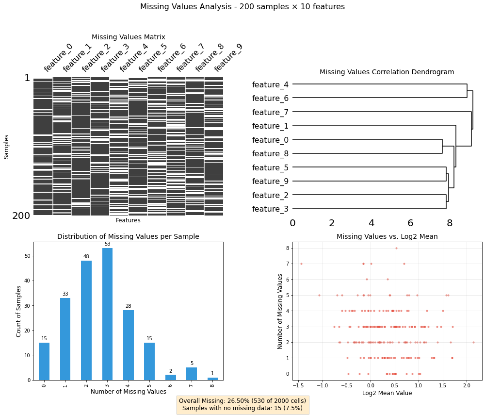

# Missing Values Utilities


<!-- WARNING: THIS FILE WAS AUTOGENERATED! DO NOT EDIT! -->

> Comprehensive tools for visualizing and analyzing missing data
> patterns.

Overview This notebook is part of the project_utility package and
provides tools for visualizing and analyzing missing data in pandas
DataFrames. The tools focus on providing multiple complementary views of
missing data patterns to help guide data cleaning and preprocessing.
Imports

## Missing Values Analysis Class

> This class provides a unified interface for visualizing missing data
> patterns.

------------------------------------------------------------------------

<a
href="https://github.com/mtinti/ProjectUtility/blob/main/ProjectUtility/mis_val_utility.py#L23"
target="_blank" style="float:right; font-size:smaller">source</a>

### MissingValuesAnalyzer

>  MissingValuesAnalyzer (df:pandas.core.frame.DataFrame)

*A class for visualizing and analyzing missing data in pandas
DataFrames.*

``` python
# Create a DataFrame with missing values
def create_sample_df(n_rows=1000, n_cols=50, missing_fraction=0.2, random_seed=42):
    """Create a sample DataFrame with controlled missing values."""
    np.random.seed(random_seed)
    
    # Create a DataFrame with random values
    df = pd.DataFrame(np.random.lognormal(0, 1, size=(n_rows, n_cols)))
    
    # Add column names
    df.columns = [f'feature_{i}' for i in range(n_cols)]
    
    # Add row names
    df.index = [f'sample_{i}' for i in range(n_rows)]
    
    # Create patterns of missing values
    
    # 1. Completely random missing values
    mask_random = np.random.random(size=df.shape) < (missing_fraction / 2)
    
    # 2. Structured missing values - some features have more missing values
    mask_cols = np.zeros(df.shape, dtype=bool)  # Explicitly use boolean dtype
    cols_with_missing = np.random.choice(n_cols, size=int(n_cols * 0.3), replace=False)
    mask_cols[:, cols_with_missing] = np.random.random(size=(n_rows, len(cols_with_missing))) < missing_fraction
    
    # 3. Structured missing values - some samples have more missing values
    mask_rows = np.zeros(df.shape, dtype=bool)  # Explicitly use boolean dtype
    rows_with_missing = np.random.choice(n_rows, size=int(n_rows * 0.2), replace=False)
    mask_rows[rows_with_missing, :] = np.random.random(size=(len(rows_with_missing), n_cols)) < missing_fraction
    
    # 4. Value-dependent missing - higher values more likely to be missing
    mask_value = (df > df.mean().mean() * 1.5) & (np.random.random(size=df.shape) < 0.5)
    
    # Combine masks
    combined_mask = mask_random | mask_cols | mask_rows | mask_value
    
    # Set values to NaN based on the mask
    df_with_missing = df.copy()
    df_with_missing[combined_mask] = np.nan
    
    return df_with_missing


# Create a sample dataframe
sample_df = create_sample_df(n_rows=200, n_cols=10)

# Check the overall missing percentage
total_missing_pct = sample_df.isna().sum().sum() / sample_df.size * 100
print(f"Total missing values: {total_missing_pct:.2f}%")
```

    Total missing values: 26.50%

## Example Usage

> Let’s create some sample data with missing values and demonstrate the
> utility:

``` python
print(1)
```

    1

``` python
# Create a missing values analyzer
mv_analyzer = MissingValuesAnalyzer(sample_df)

# Generate the dashboard
fig, axes, summary = mv_analyzer.plot_missing_dashboard()
```



## Group-Based MinProb Imputation for Proteomics Data

> Overview

This utility implements a specialized imputation strategy for proteomics
data that handles missing values in a biologically meaningful way. The
approach is based on the MinProb imputation strategy commonly used in
proteomics analysis, but with modifications to work on a condition group
basis.

### Imputation Strategy

The imputation follows these key principles: - Condition-Based
Statistics: For each experimental condition group, the algorithm
computes distribution statistics by pooling all values across replicates
and proteins. - Selective Imputation: Missing values are only imputed
when all measurements for a protein within a specific condition group
are missing. This approach is ideal for handling proteins that are
completely undetected in certain conditions. - Low-Intensity
Replacement: Following the MinProb philosophy, missing values are
imputed as low-intensity signals, drawn from a normal distribution
centered at a low quantile of the observed values.

------------------------------------------------------------------------

<a
href="https://github.com/mtinti/ProjectUtility/blob/main/ProjectUtility/mis_val_utility.py#L274"
target="_blank" style="float:right; font-size:smaller">source</a>

### group_based_minprob_impute

>  group_based_minprob_impute (df, group_vector, quantile=0.0001,
>                                  sd_factor=0.2, random_state=None)

\*Group-based MinProb imputation for proteomics data. First computes
quantile distribution statistics for each condition group by merging all
values within the condition. Then imputes missing values only for rows
where all values in a particular condition are missing by drawing random
values from the calculated distribution.

Parameters: df (pd.DataFrame): Input DataFrame in log space (rows:
proteins, columns: samples) group_vector (list): Vector indicating group
membership of each column quantile (float): Quantile to use as the
center for the imputation (default: 0.01) sd_factor (float): Factor to
multiply the standard deviation for noise level (default: 0.2)
random_state (int, optional): Random seed for reproducibility

Returns: pd.DataFrame: DataFrame with imputed missing values.\*

## Usage example

``` python
# Create a toy DataFrame in log2 space
np.random.seed(42)
data = np.log2(np.random.rand(10, 5) * 1e4)
df_example = pd.DataFrame(data, columns=[f'Sample{i+1}' for i in range(5)])

# Define condition groups: first 3 columns are group 1, last 2 columns are group 2
groups = [1, 1, 1, 2, 2]

# Introduce missing values by groups
# Make all values in group 1 missing for row 2
df_example.iloc[2, 0:3] = np.nan

# Make all values in group 2 missing for row 5
df_example.iloc[5, 3:5] = np.nan

print("Before imputation:")
print(df_example)
print("\nGroup vector:", groups)

# Apply the imputation
imputed_df = group_based_minprob_impute(df_example, groups, random_state=42)

print("\nAfter imputation:")
print(imputed_df)
#selection_normed = group_based_minprob_impute(np.log2(df).copy(), group_vector=[1,1,1,2,2,3,3,4,4,4,5,5,5])
```

    Before imputation:
         Sample1    Sample2    Sample3    Sample4    Sample5
    0  11.870905  13.214796  12.837616  12.547518  10.607503
    1  10.607280   9.181987  13.080445  12.553425  12.789682
    2        NaN        NaN        NaN  11.052154  10.828335
    3  10.840813  11.571005  12.357432  12.076632  11.507939
    4  12.578969  10.445986  11.512467  11.839054  12.155040
    5  12.938800  10.963429  12.328211        NaN        NaN
    6  12.568775  10.735760   9.345441  13.212018  13.237258
    7  12.980849  11.572765   9.931803  12.740272  12.103788
    8  10.253118  12.273728   8.425783  13.150573  11.337510
    9  12.693753  11.605994  12.344485  12.416561  10.852174

    Group vector: [1, 1, 1, 2, 2]
    Computing condition statistics:
      Condition 1: 27 valid values, center=8.4277, noise_sd=0.2576
      Condition 2: 18 valid values, center=10.6079, noise_sd=0.1666

    Imputing missing values:
      Imputed missing values for row 2 (index: 2)
      Imputed missing values for row 5 (index: 5)

    Imputation complete: 5 values imputed across 10 rows

    After imputation:
         Sample1    Sample2    Sample3    Sample4    Sample5
    0  11.870905  13.214796  12.837616  12.547518  10.607503
    1  10.607280   9.181987  13.080445  12.553425  12.789682
    2   8.427749   8.392130   8.427749  11.052154  10.828335
    3  10.840813  11.571005  12.357432  12.076632  11.507939
    4  12.578969  10.445986  11.512467  11.839054  12.155040
    5  12.938800  10.963429  12.328211  10.607878  10.568862
    6  12.568775  10.735760   9.345441  13.212018  13.237258
    7  12.980849  11.572765   9.931803  12.740272  12.103788
    8  10.253118  12.273728   8.425783  13.150573  11.337510
    9  12.693753  11.605994  12.344485  12.416561  10.852174
